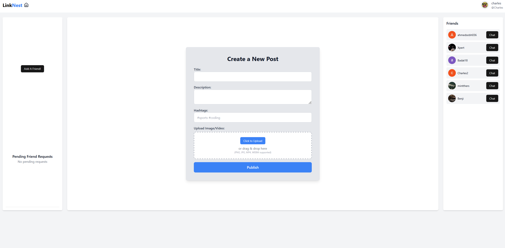

This is a [Next.js](https://nextjs.org) project bootstrapped with [`create-next-app`](https://nextjs.org/docs/app/api-reference/cli/create-next-app).
# Linknest

## The Linknest Team
- Abdullah Badat
- Charles-Alexandre Bouchard
- Thiha Min Thein
- Mohammad Mahbub Rahman
- Ahmed Sobh

## Project Description
    A new social media website where users can create an account, create, comment, like and share posts. 
    Users can chat with each other, one on one or in group chats, with complete encryption of all chat logs. 
    Users can Video Call each other. 
    Complete with full moderation features, such as reporting posts, 
    banning users who do not follow the terms of service and blocking users.

## Technology Stack
    NextJS, Typescript, Firebase. 

## Environment Variables
```bash
NEXT_PUBLIC_FIREBASE_API_KEY=[Firebase ENV Variables Provided by Firebase]
NEXT_PUBLIC_FIREBASE_AUTH_DOMAIN=[Firebase ENV Variables Provided by Firebase]
NEXT_PUBLIC_FIREBASE_PROJECT_ID=[Firebase ENV Variables Provided by Firebase]
NEXT_PUBLIC_FIREBASE_STORAGE_BUCKET=[Firebase ENV Variables Provided by Firebase]
NEXT_PUBLIC_FIREBASE_MESSAGING_SENDER_ID=[Firebase ENV Variables Provided by Firebase]
NEXT_PUBLIC_FIREBASE_APP_ID=[Firebase ENV Variables Provided by Firebase]
NEXT_PUBLIC_FIREBASE_MEASUREMENT_ID=[Firebase ENV Variables Provided by Firebase]
AZURE_SAS=[Azure SAS]
AZURE_STORAGE_ACCOUNT=[Azure Storage Account]
AZURE_BLOB_CONTAINER=[Name of Azure Blob Container]
NEXT_PUBLIC_AGORA_APP_ID=[Agora App ID]
NEWS_API_TOKEN=[News API Token]
GOOGLE_CLIENT_ID=[Google Client ID]
GOOGLE_CLIENT_SECRET=[Google Client Secret]
AUTH_SECRET=[Authentication Secret]
BLUESKY_USERNAME=[Your Bluesky Account Username]
BLUESKY_PASSWORD=[Your Bluesky Account Password]
NEXTAUTH_URL=[Your Deployed Website URL]
```
## Development Server

Install dependencies:

```bash
Install Node Version 22.14.0
```

```bash
npm install
```

Run the development server:

```bash
npm run dev
```

Open [http://localhost:3000](http://localhost:3000) with your browser to see the result.

Run Tests:
```bash
npm run test
```
## Production Website Links

[`Production Deployment Website`](https://www.linknest.live/).
[`Development Deployment Website`](https://linknest-rqd1.onrender.com/).

## Screenshots

Login with the Sign in button in the top right. <br />

Welcome to the home page. <br />
 <br />
Click your Profile Picture for different options. <br />

Add friends and chat with them! <br />

Look at user profiles. <br />

Create Posts! <br />

## Rationale behind development deployment
    We use Vercel as the Production Deployment since it is much faster than Render and Azure, which was not loading images.
    Our development deployment is render, since it is what we were using before and it was already set up.

## Health check
    We have a /health route which is being tracked by a monitoring system to track if our website is up.

## Champion features
- Moderation/Automation: Charles-Alexandre Bouchard
    * We have a cron job that runs our Bluesky and News APIs every hour to add new posts to their respective tabs, we also have a Report system, a ban system and a block system.
- Community: Thiha Min Thein and Ahmed Sohb
    * We have multiple features that allow for a more interesting user experience, such as group chats, reactions to messages, notifications, replies to chats, and a Mobile View.
- Security: Mohammad Mahbub Rahman
    * We have encrypted messaging, so that even if there was a data breach, no user data would be leaked.
- Performance: Abdullah Badat
    * We have server side and browser caching implemented, we also only make more posts load if the user scrolls to not use too much memory. The Performance score of our website is pretty high on the Production deployment.