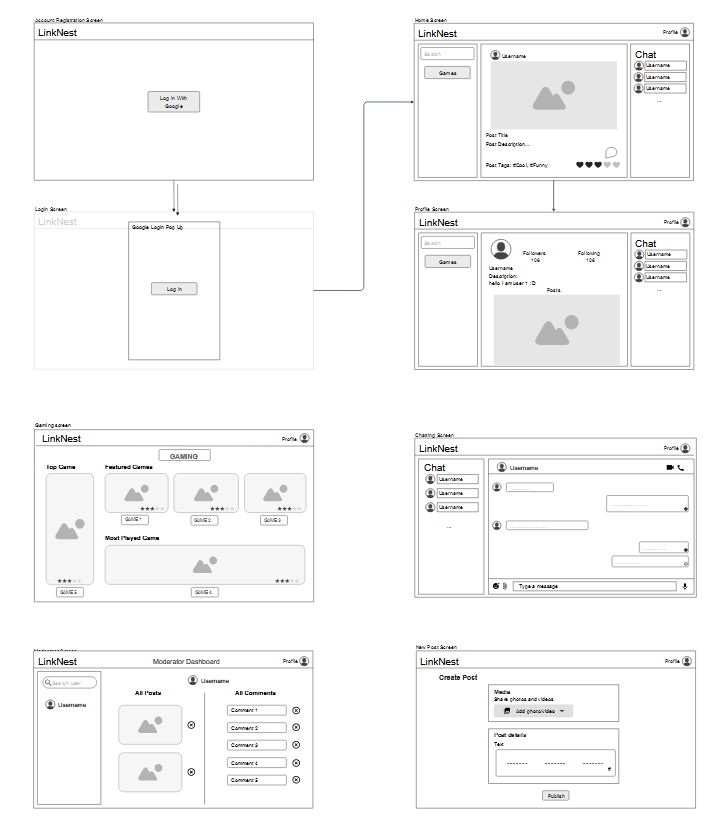
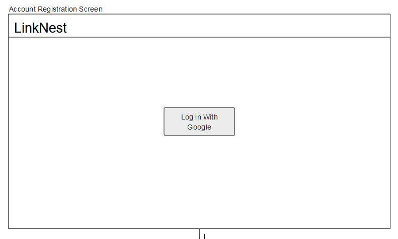
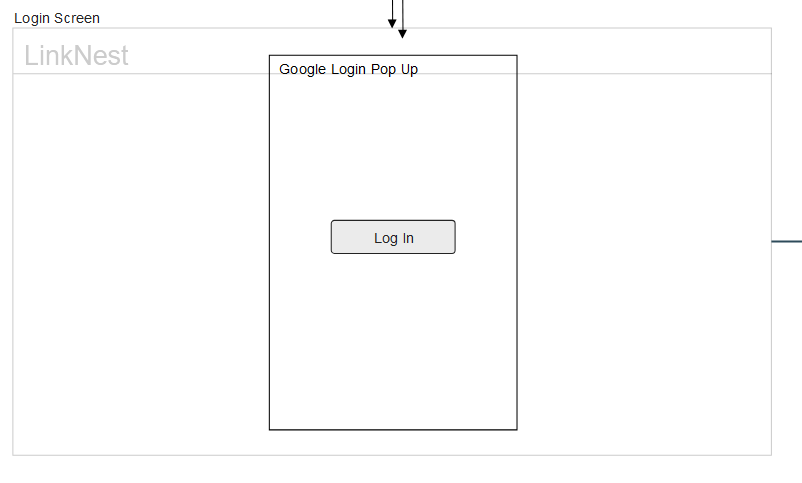
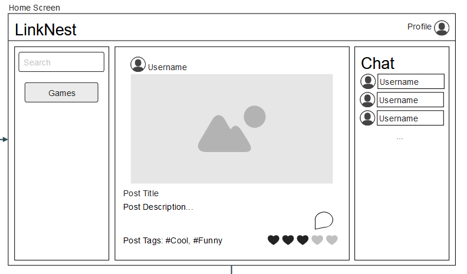
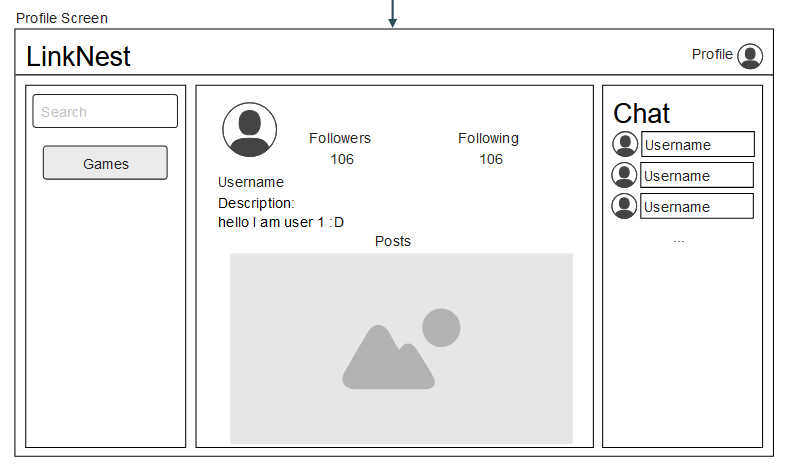
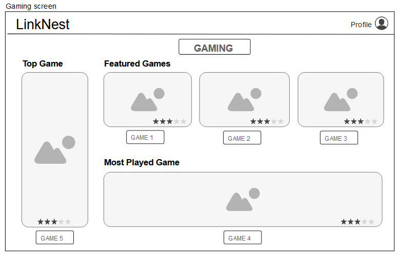
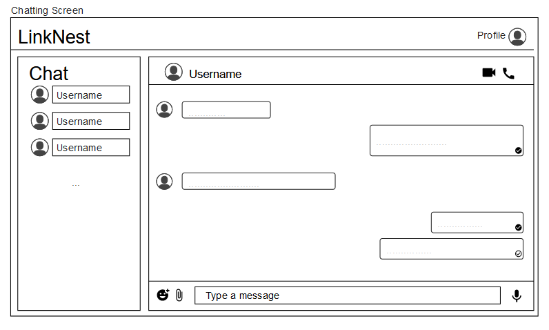
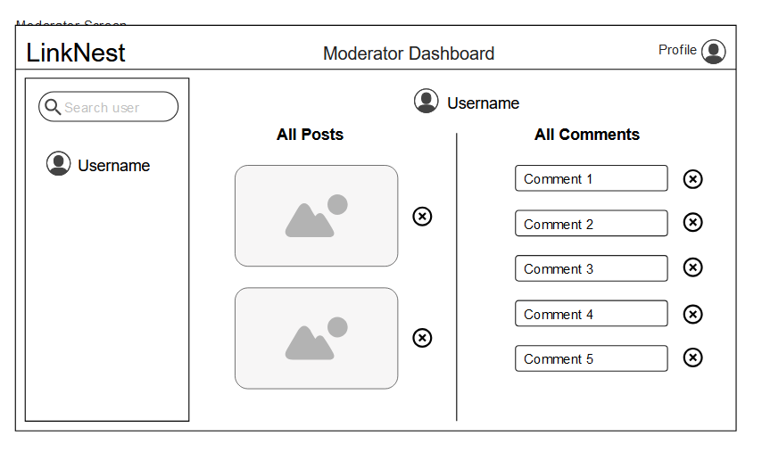
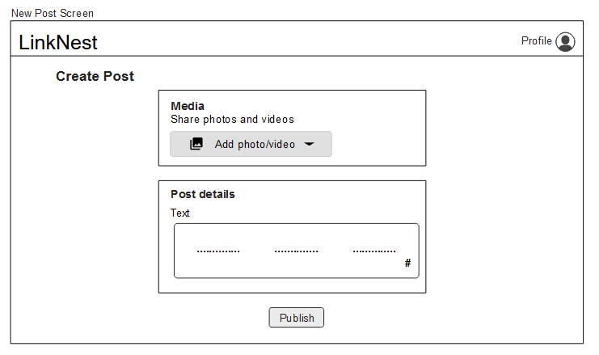

# Project Proposal

### Student participant names

- Charles-Alexandre Bouchard
- Ahmed Sobh
- Thiha Min Thein
- Mohammad Mahbub Rahman
- Abdullah Badat

### Software company name 

_LinkedOut Corp._

### Official project name

_LinkNest_

### Project’s internal codename

_Tyler_

## Project Goals

The goal of this project is to make a **full stack** website allowing users to connect and communicate between each other in various ways. **LinkNest** will allow you to stay in touch and informed by scrolling through updated **news articles**, view other users **posts** and **listings** from the marketplace. We believe that creating a project which could serve as a competition to the current social media apps currently dominating the market is necessary. In order to do so, we will make LinkNest full of fun features taken from **all your favorite social media apps in one**. We will also develop LinkNest using **Typescript**, **Next.Js** and **Firebase**. The chat history will be encrypted and securely stored in Firebase, and **moderators** will be assigned to filter and remove harmful content, ensuring a safe space for all users. Users will be able to select **tags** that align with their interests, which will be reflected in their feed. By incorporating key features from major social media platforms and offering a comprehensive, **"jack-of-all-trades" experience**, our app will deliver a competitive edge and establish itself as a unique contender in the social media landscape.

## The DataSet

For LinkNest, we are planning to use **two** datasets that are updated on a regular basis. The first one is related to the **news** aspect of our page. In order to constantly have live updates on the world, we will be using **TheNewsAPI** dataset to constantly get news for our application. We will figure out ways to fetch new data on a timely schedule in the future by using a **CronJob**. 

Link: https://www.thenewsapi.com/login

Second of all, our project will consist of a scrolling feature where users can view numerous types of content endlessly (a feed). In order to maintain the feeling of viewing new content constantly, we will utilize the **BlueSky** dataset to display posts on the feed alongside our other dataset. That way, the content will be a combination of our applications core features, and BlueSky’s content as well, making LinkNest more **alive**. Having two data sources ensures that our user will have access to more data on their feed, and be able to refresh the page more often and get fresh data, which wouldn’t have been optimal with only one dataset.

Link: https://docs.bsky.app/docs/advanced-guides/firehose

## Why Is Our App Unique?

In the current market, there are numerous social networking applications and messaging platforms folks use everyday in order to fulfill their needs. Notably, there is _Facebook_, _Instagram_, _WhatsApp_, _LinkedIn_, _SnapChat_, _Discord_, etc. These needs in question can be grouped into many categories; *talking* to friends or starting new *conversations* with strangers, *selling* or *buying* items from other users, being *up to date* regarding the latest news in the world as of today, *building* a brand to attract new customers, **entertaining** yourself when you are bored, and many other more reasons. Now, what if we were to take all these beloved features and desires people want across all the different applications, but into a **singular platform**? With LinkNest, we hope to not only bring a sense of pertinence when using it, but also the feeling of **being in control** of what you are consuming. We plan to make our application highly **customizable**, which includes not only your **profile**, but the **chat rooms** and the **feed** themselves, where you can choose the font, background images, dark/light mode, and many options. We also will add chats, **voice calls and video calls** to communicate with friends and family from anywhere in the world. We also plan to implement a **market type view**, where businesses and like-minded independent sellers promote their **products** and generate more revenue, while making sure the communication between users is smooth-sailing and easy. For those who are intrigued by the current state of the world day to day, we will also have a view for the **latest news**. With these 3 functionalities (user posts, news and market listings), this will diversify the type of content you can see in your feed, which is different from other platforms out there. Finally, we also plan to add **playable games** between users, with **tracked wins** and **possibly leaderboards**. LinkNest will hopefully link people together with different interests, but can share the same platform.

## User Personas

### User Persona 1

##### Persona description: Content sharer

##### Name: Emily

##### Importance of users corresponding to this persona: Very Important. 70% or more of users.

##### Broad goal: Share life updates and engage with my network of friends and family.

###### User stories (give at least 2)

- **As a social media sharer**, I want to post text and images to let my friends and family know what I am up to.

_A posting feature which allows for text, images, and videos to be uploaded to your feed._

- **As a social media sharer**, I want to engage with my friends’ content.

_Reaction buttons and comment section feature which allows to engage with other people’s posts._

- **As a social media sharer**, I want to update my profile picture to reflect my personality.

_A profile customization option that lets users upload and edit profile pictures._

- **As a social media sharer**, I want to create group chats with my friends to stay connected and plan activities.

_Group chat functionality with the ability to invite friends, set group names and send messages._

### User Persona 2

##### Persona description: Content browser

##### Name: Alex

##### Importance of users corresponding to this persona: Very Important. 70% or more of users.

##### Broad goal: To discover interesting content, communities and events that align with their interests.

###### User stories (give at least 2)

- **As a content browser**, I want to follow pages and groups that I am interested in.

_There is a follow button on profiles to add them to your following list._

- **As a content browser**, I want to scroll through a personalized feed of posts.

_Following section which contains posts only from people you follow._

- **As a content browser**, I want to take a break by playing a quick game with a friend.

_A mini game feature like Tic Tac Toe that can be initiated with a friend._

### User Persona 3

##### Persona description: Marketplace User

##### Name: Mia

##### Importance of users corresponding to this persona: Very Important. 30% or more of users.

##### Broad goal: To buy or sell items in a convenient, trustworthy and local environment.

###### User stories (give at least 2)

- **As a marketplace user**, I want to browse items for sale near me.

_A searchable and filterable marketplace feed with location based sorting._

- **As a marketplace user**, I want to list items for sale and provide relevant details, like price, description, and photos.

_A listing feature with options for uploading images, setting descriptions and prices._

- **As a marketplace user**, I want to save items I’m interested in for later review.

_A wishlist feature that allows users to bookmark listings._

### User persona 4

##### Persona description: News Feed Consumer

##### Name: James

##### Importance of users corresponding to this persona: Very Important. 80% or more of users.

##### Broad goal: To stay connected and informed by scrolling through updated news articles.

###### User stories (give at least 2)

- As a news feed consumer, i want to read the news and keep getting regular updates as to what is happening around the world.

_A news tab which displays frequently updated news articles._

- As a news feed consumer, I want to hide or report posts that are irrelevant or offensive.

_Option to report content with a quick and simple form._

- As a news feed consumer, I want to only see the most trending information.

_A sorting feature that shows news articles with the most interactivity._

### User persona 5

##### Persona description:  Content moderator

##### Name: Sarah

##### Importance of users corresponding to this persona: Very Important. Small percentage of users but critical for maintaining quality and safety.

##### Broad goal: To monitor, review and manage user content to ensure a safe and positive experience.

###### User stories (give at least 2)

- As a **content moderator**, I Want to be able to remove posts that violate community guidelines.

_A remove post option for set moderator profiles._

- As a **content moderator**, I want to review reported posts to decide whether to remove them.

_A list of flagged posts to be reviewed by a moderator._

- As a **content moderator**, I want to ban users who repeatedly violate guidelines.

_User suspension feature that only moderators are allowed to use._

## Mock-ups

##### Full View

##### Account Registration Screen

##### Login Screen

##### Home Screen

##### Profile Screen

##### Gaming Screen 

##### Chatting Screen

##### Moderator Screen

##### New Post Screen

